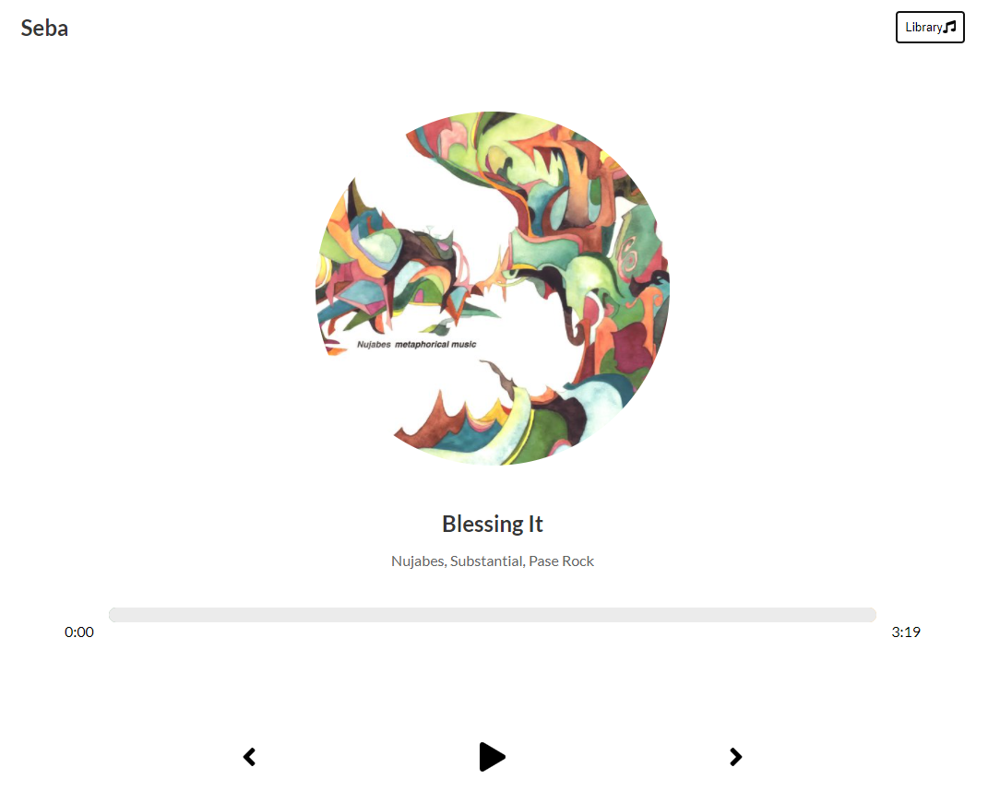

# Seba

<h1 id="intro">Introduction</h1>
Seba is my tribute to the late and great Nujabes.  Users can listen to a library of some of my favorite Nujabes songs with more on the way.  Rest in beats.

<h1 id="user_guide">User Guide</h1>
Go to <a href="https://seba-45e88.web.app/">seba-45e88.web.app</a> to drift away like a feather in air.

## To start the app:

### Run

### `yarn start`

Open localhost:3000 to open the app in the browser.

<h1 id="tech_stack">Tech Stack</h1>
Seba was made using React.
