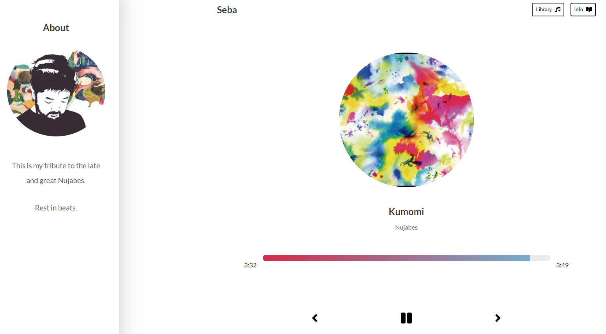

# Seba: Embrace the Nujabes Vibes 🎧

<h1 id="intro">Welcome to Seba</h1>
Introducing Seba, my homage to the legendary Nujabes. Delight your ears with a curated collection of my favorite Nujabes tracks and stay tuned for more. Immerse yourself in the soothing soundscapes of the GOAT. Rest in beats.

<h1 id="user_guide">How to Enjoy Seba</h1>
Ready for a transcendent experience? Visit <a href="https://seba-45e88.web.app/">seba-45e88.web.app</a> and let the music carry you like a feather in the wind.

Good news: Seba is mobile-friendly too!

## Unleash Seba:

### Install Dependencies

First, install the required dependencies using:

### `yarn install`

### Run the App

Next, start the app with:

### `yarn start`

Launch the app in your browser at localhost:3000.

<h1 id="tech_stack">Behind the Scenes</h1>
Seba is brought to life using the power of React.
